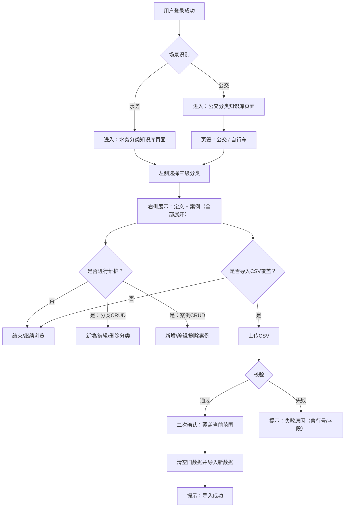
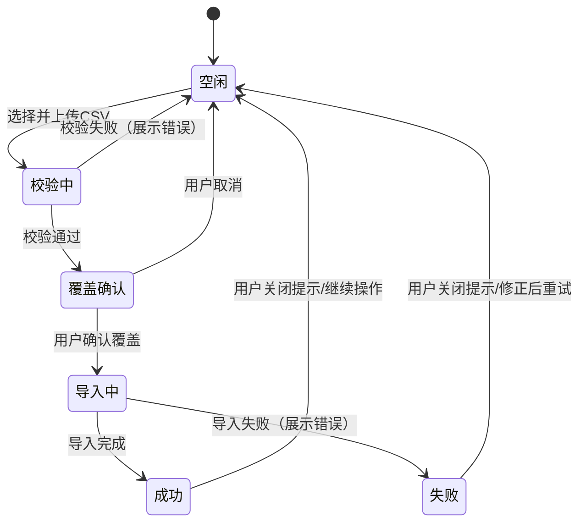

# 产品需求文档：分类知识库展示模块 - V1.12

## 1. 综述 (Overview)
### 1.1 项目背景与核心问题
当前系统已具备独立的“QA审核”工作流，但业务侧还需要一套面向一线/运营/质检的“分类知识库”能力，用于沉淀并展示**三级分类标签体系**及其**释义**，并为每个三级分类提供多个“用户-客服对话案例”，以帮助：
1) 统一口径：让不同人员对分类边界与定义的理解一致；
2) 降低歧义：通过真实对话案例帮助快速判别与学习；
3) 可维护：支持分类与案例的增删改查，以及通过CSV做全量覆盖式导入以快速初始化与批量更新。

本模块与现有“QA审核模块”在业务与数据上**相互独立**，仅共用同一系统的登录与导航体系。

### 1.2 核心业务流程 / 用户旅程地图
本版本聚焦于“分类知识库展示与维护”的最小可用闭环（MVP），其核心旅程分为以下阶段：
1.  **阶段一：按登录场景进入页面** - 用户登录后，系统根据其场景（`水务` / `公交`）自动进入对应的分类知识库页面，并做数据隔离。
2.  **阶段二：浏览与查看** - 用户通过左侧三级分类树定位到某个三级分类，查看其定义与该分类下的所有对话案例（默认全部展开显示全文）。
3.  **阶段三：维护（CRUD）** - 用户可在当前场景/页签范围内维护分类树（至三级）与案例（仅挂三级）。
4.  **阶段四：CSV导入覆盖** - 用户在当前页面/页签内上传单个CSV，校验通过后对当前范围数据做一次“清空并覆盖”的全量导入。

### 1.3 Mermaid 图（流程/状态/时序）
> 说明：Mermaid 图用于“需求对齐”，避免歧义；避免写成技术实现细节（不要写 API 路径、字段、HTTP code、框架/库）。

#### 1.3.1 用户操作流（必填）


#### 1.3.2 状态机（当存在明确状态流转对象时必填）
本模块存在“导入任务”的用户可见状态流转（用于反馈与避免重复操作）：


## 2. 用户故事详述 (User Stories)

### 阶段一：按登录场景进入页面

---

#### **US-KB-01: 作为已登录用户，我希望系统按我的登录场景自动进入对应的分类知识库页面，以便我只看到本场景的数据并快速开始浏览。**
*   **价值陈述 (Value Statement)**:
    *   **作为** 已登录用户
    *   **我希望** 无需手动切换业务域，系统自动进入我所属场景的分类知识库页面
    *   **以便于** 保持数据隔离与操作路径简单明确。
*   **业务规则与逻辑 (Business Logic)**:
    1.  **前置条件**: 用户已登录；系统已识别用户所属场景（`水务`或`公交`）。
    2.  **页面路由与可见性**:
        *   **水务场景**: 仅进入并可操作“水务分类知识库”页面；不展示“公交/自行车”的切换入口。
        *   **公交场景**: 进入“公交分类知识库”页面；页面内提供页签 `公交` 与 `自行车`，两套数据均可查看与维护。
    3.  **数据隔离**:
        *   水务用户仅可读写“水务”范围数据。
        *   公交用户在“公交”页签仅读写“公交”数据；在“自行车”页签仅读写“自行车”数据。
    4.  **浏览与查看**:
        *   用户在左侧树点击某个三级分类后，右侧展示该三级的`定义`与其下所有案例。
        *   案例展示默认**全部展开**显示对话全文。
    5.  **异常处理**:
        *   当前范围无任何分类数据时，右侧展示空态提示“暂无数据，请先导入CSV或新增分类”。
        *   加载失败时提示“加载失败，请重试”并提供重试入口。
*   **验收标准 (Acceptance Criteria)**:
    *   **场景1: 水务用户进入水务页面**
        *   **GIVEN** 我以水务场景账号登录
        *   **WHEN** 我进入“分类知识库模块”
        *   **THEN** 我只能看到水务分类知识库页面内容，页面不出现“公交/自行车”页签或跨场景切换入口。
    *   **场景2: 公交用户切换页签**
        *   **GIVEN** 我以公交场景账号登录并进入分类知识库页面
        *   **WHEN** 我切换到“自行车”页签
        *   **THEN** 左侧分类树与右侧内容切换为自行车范围数据，且不应混入公交/水务的数据。
    *   **场景3: 案例默认全部展开**
        *   **GIVEN** 某三级分类下存在3条案例
        *   **WHEN** 我点击该三级分类进入详情
        *   **THEN** 我能直接看到3条案例的完整对话全文（全部展开），无需额外点击“展开”。
---
*   **页面布局线框图 (ASCII Wireframe)**:
    ```text
    <!-- 水务场景：无页签 -->
    +----------------------------------------------------------------------------------+
    | 顶部栏：Logo | 导航：审核模块 | 分类知识库(当前) | ... | 用户信息/退出            |
    +----------------------------------------------------------------------------------+
    | 水务分类知识库                                                                    |
    |----------------------------------------------------------------------------------|
    | 左侧：三级分类树                         | 右侧：三级详情                          |
    | +---------------------------+            | +------------------------------------+ |
    | | 一级：查询咨询            |            | | 路径：一级/二级/三级                 | |
    | |  └─二级：水费查询          |            | +------------------------------------+ |
    | |     ├─三级：水量  (选中)   |            | | 定义（单字段，支持多行）              | |
    | |     └─三级：水费           |            | +------------------------------------+ |
    | | 一级：供水处置            |            | | 案例（默认全部展开）                  | |
    | |  └─...                    |            | | [案例#1 全文... 可滚动]              | |
    | +---------------------------+            | | [案例#2 全文... 可滚动]              | |
    |                                          | | [案例#3 全文... 可滚动]              | |
    |                                          | +------------------------------------+ |
    +----------------------------------------------------------------------------------+

    <!-- 公交场景：含页签 -->
    +----------------------------------------------------------------------------------+
    | 顶部栏：Logo | 导航：审核模块 | 分类知识库(当前) | ... | 用户信息/退出            |
    +----------------------------------------------------------------------------------+
    | 公交分类知识库                    [页签：公交] [页签：自行车]                     |
    |----------------------------------------------------------------------------------|
    | 左侧：三级分类树                         | 右侧：三级详情（同上）                  |
    +----------------------------------------------------------------------------------+
    ```

### 阶段二：维护（分类与案例 CRUD）

---

#### **US-KB-02: 作为知识库维护者，我希望能维护三级分类树及三级定义，以便分类体系与释义可持续迭代并支撑案例挂载。**
*   **价值陈述 (Value Statement)**:
    *   **作为** 知识库维护者
    *   **我希望** 对三级分类树进行新增/编辑/删除，并维护三级分类的定义
    *   **以便于** 分类体系可持续完善，且对话案例能有清晰的挂载目标与解释口径。
*   **业务规则与逻辑 (Business Logic)**:
    1.  **前置条件**: 用户已登录；位于其可见范围（水务 / 公交 / 自行车页签）。
    2.  **层级约束**:
        *   分类固定三级：一级/二级/三级。
        *   `定义`仅在三级维护；一级/二级仅用于组织结构。
    3.  **新增**:
        *   在一级节点下可新增二级；在二级节点下可新增三级。
        *   新增三级时必填：`三级名称`、`定义`。
    4.  **编辑**:
        *   可编辑节点名称。
        *   三级节点可编辑`定义`（支持多行文本）。
    5.  **删除（防误删）**:
        *   不允许删除“仍有子节点”的节点（提示先删除/迁移子节点）。
        *   删除三级节点时：若该三级下存在案例，需要二次确认；确认后**级联删除**该三级下所有案例。
    6.  **展示排序**: 左侧树按节点名称自动排序（同级排序）。
    7.  **异常处理**:
        *   新增/编辑保存失败：提示失败原因并保持表单内容不丢失。
        *   删除失败：提示失败原因，数据不变。
*   **验收标准 (Acceptance Criteria)**:
    *   **场景1: 新增三级分类**
        *   **GIVEN** 我在某二级分类节点上选择“新增三级”
        *   **WHEN** 我输入三级名称与定义并保存成功
        *   **THEN** 左侧树出现新三级节点（按名称排序），点击后右侧可查看该三级定义与空案例列表。
    *   **场景2: 删除含案例的三级分类**
        *   **GIVEN** 某三级分类下已有2条案例
        *   **WHEN** 我删除该三级并在二次确认中确认删除
        *   **THEN** 该三级与其2条案例一起删除，页面提示删除成功且树与右侧同步刷新。
    *   **场景3: 禁止删除有子节点的节点**
        *   **GIVEN** 某一级分类下仍有二级或三级子节点
        *   **WHEN** 我尝试删除该一级分类
        *   **THEN** 系统阻止删除并提示“请先删除/迁移子节点”。
---
*   **页面布局线框图 (ASCII Wireframe)**:
    ```text
    +----------------------------------------------------------------------------------+
    | 分类知识库（当前范围：水务/公交Tab/自行车Tab）                                     |
    +----------------------------------------------------------------------------------+
    | 左侧：三级分类树                             | 右侧：详情                           |
    | +-----------------------------------------+  | +----------------------------------+ |
    | | [搜索分类名称...]                         |  | | 路径：一级/二级/三级               | |
    | | 一级：查询咨询                [···]       |  | | [编辑三级] [删除三级]              | |
    | |  └─二级：水费查询              [···]       |  | +----------------------------------+ |
    | |     ├─三级：水量 (选中)       [···]       |  | | 定义：                              | |
    | |     └─三级：水费              [···]       |  | | [多行文本展示区域]                  | |
    | +-----------------------------------------+  | +----------------------------------+ |
    |                                            |
    | 右侧或更多菜单示例：                         |
    | - 一级/二级节点菜单：新增子节点、重命名、删除 |
    | - 三级节点菜单：重命名、删除                 |
    |
    | 新增/编辑弹窗（三级示例）：                   |
    | +------------------------------------------+ |
    | | 标题：新增三级分类                         | |
    | | 三级名称： [______________] (必填)         | |
    | | 定义：                                     | |
    | | [ 多行输入框........................ ]     | |
    | |                     [取消] [保存]          | |
    | +------------------------------------------+ |
    ```

---

#### **US-KB-03: 作为知识库维护者，我希望能在三级分类下维护多条对话案例，并默认展开展示全文，以便用真实语料帮助理解分类边界。**
*   **价值陈述 (Value Statement)**:
    *   **作为** 知识库维护者
    *   **我希望** 在某个三级分类下新增/编辑/删除对话案例
    *   **以便于** 通过真实对话示例让分类的理解与判别更直观、可学习、可复用。
*   **业务规则与逻辑 (Business Logic)**:
    1.  **前置条件**: 用户已登录；已选择某个三级分类进入详情。
    2.  **挂载规则**:
        *   案例只能挂在三级分类下。
        *   单条案例只挂一个三级分类。
    3.  **字段（MVP）**:
        *   `对话全文`（必填，多行文本，允许包含“用户/客服”多轮对话内容）。
    4.  **展示**:
        *   进入三级详情后，该三级下**所有案例默认全部展开**显示全文（无需点击展开）。
    5.  **新增/编辑**:
        *   新增案例从当前三级详情页发起；保存后立即出现在列表中。
        *   编辑案例保存后立即更新展示。
    6.  **删除**:
        *   删除单条案例需二次确认；确认后从列表移除。
    7.  **查询（当前三级内）**:
        *   支持在当前三级详情中对案例全文做关键词过滤（仅影响当前列表展示）。
    8.  **异常处理**:
        *   保存失败：提示失败原因并保留输入内容，允许重试。
*   **验收标准 (Acceptance Criteria)**:
    *   **场景1: 新增案例并默认展开**
        *   **GIVEN** 我已进入某三级分类详情
        *   **WHEN** 我新增一条包含多行对话全文的案例并保存成功
        *   **THEN** 该案例出现在案例列表中，且默认展开显示完整对话全文。
    *   **场景2: 删除案例**
        *   **GIVEN** 当前三级下存在至少1条案例
        *   **WHEN** 我删除其中一条并确认
        *   **THEN** 该案例从列表移除，其余案例保持不变。
---
*   **页面布局线框图 (ASCII Wireframe)**:
    ```text
    +----------------------------------------------------------------------------------+
    | 三级详情：一级/二级/三级                                                          |
    +----------------------------------------------------------------------------------+
    | 定义：                                                                            |
    | [定义多行展示区域]                                                                |
    |----------------------------------------------------------------------------------|
    | 案例（默认全部展开）                     [在本三级内搜索案例关键词...] [搜索]     |
    |----------------------------------------------------------------------------------|
    | 案例#1  [编辑] [删除]                                                            |
    | +------------------------------------------------------------------------------+ |
    | | 客服:...                                                                      | |
    | | 用户:...                                                                      | |
    | | ...（可滚动）                                                                 | |
    | +------------------------------------------------------------------------------+ |
    |----------------------------------------------------------------------------------|
    | 案例#2  [编辑] [删除]                                                            |
    | +------------------------------------------------------------------------------+ |
    | | ...                                                                          | |
    | +------------------------------------------------------------------------------+ |
    |----------------------------------------------------------------------------------|
    | [ + 新增案例 ]                                                                   |
    |
    | 新增/编辑案例弹窗：                                                              |
    | +------------------------------------------+                                     |
    | | 标题：新增案例                              |                                     |
    | | 对话全文（必填）：                           |                                     |
    | | [ 多行输入框........................ ]     |                                     |
    | |                     [取消] [保存]          |                                     |
    | +------------------------------------------+                                     |
    ```

### 阶段三：CSV导入覆盖

---

#### **US-KB-04: 作为知识库维护者，我希望能在当前页面/页签上传单个CSV并覆盖导入，以便快速初始化与批量更新分类与案例。**
*   **价值陈述 (Value Statement)**:
    *   **作为** 知识库维护者
    *   **我希望** 通过一次CSV导入完成分类与案例的批量更新
    *   **以便于** 避免大量手工录入，提高初始化与迭代效率，并确保数据口径与源文件一致。
*   **业务规则与逻辑 (Business Logic)**:
    1.  **前置条件**: 用户已登录并位于目标范围（水务页面 / 公交页签 / 自行车页签）。
    2.  **覆盖范围**:
        *   导入行为仅覆盖“当前范围”的数据：
            *   水务页面导入：覆盖水务数据。
            *   公交页面导入：覆盖当前页签对应的数据（公交或自行车）。
    3.  **CSV列定义**:
        *   固定列：`业务域, 一级, 二级, 三级, 定义`
        *   动态案例列：`案例1, 案例2, 案例3 ...`（识别所有以“案例”开头的列名；空值忽略）
        *   同一行可包含多条案例（通过多个案例列提供）。
        *   CSV可存在多行指向同一分类路径（见“合并规则”）。
    4.  **导入校验（校验失败则整批不导入）**:
        *   **域一致性校验**: CSV所有行的`业务域`必须等于当前范围（例如当前为“公交”页签，则所有行必须为“公交”）。
        *   **必填校验**: `业务域/一级/二级/三级/定义`不能为空。
        *   **定义一致性校验**: 当同一 `(业务域, 一级, 二级, 三级)` 在CSV中出现多行时：
            *   若`定义`完全一致：允许合并。
            *   若`定义`不一致：整批失败不导入，并返回错误原因（需包含冲突行号与冲突点说明）。
        *   **错误返回要求**: 必须返回可操作的错误信息（至少包含：行号、列名、错误原因/期望值）。
    5.  **合并与导入规则**:
        *   对于同一 `(业务域, 一级, 二级, 三级)` 的多行：合并为同一个三级分类；案例做追加。
        *   **案例不去重**: 即使案例文本完全相同，也按CSV原样导入并保留为多条案例。
    6.  **覆盖执行**:
        *   校验通过后必须二次确认：“将清空并覆盖当前范围全部分类与案例数据，是否继续？”
        *   覆盖导入需保证原子性：要么全部成功并生效，要么失败且不改变原数据。
    7.  **异常处理**:
        *   校验失败：不落库，展示错误列表并允许用户修正CSV后重试。
        *   导入执行失败：提示失败原因并保证数据不被部分覆盖。
*   **验收标准 (Acceptance Criteria)**:
    *   **场景1: 当前范围覆盖成功**
        *   **GIVEN** 我位于公交页面的“公交”页签，且CSV中所有行的业务域均为“公交”
        *   **WHEN** 我上传CSV，校验通过并确认覆盖
        *   **THEN** 公交页签下的数据以CSV为准；自行车页签数据不受影响；页面提示“导入成功”。
    *   **场景2: 业务域不一致导致失败**
        *   **GIVEN** 我位于水务页面
        *   **WHEN** 我上传的CSV中包含业务域为“公交”的行
        *   **THEN** 导入失败且不落库，错误信息包含该行行号与“期望业务域=水务，实际=公交”。
    *   **场景3: 同一分类定义冲突导致失败**
        *   **GIVEN** CSV中同一 `(业务域,一级,二级,三级)` 出现两行且定义不同
        *   **WHEN** 我上传CSV
        *   **THEN** 导入失败且不落库，错误信息包含冲突行号与“同一分类定义不一致”的原因说明。
---
*   **页面布局线框图 (ASCII Wireframe)**:
    ```text
    +----------------------------------------------------------------------------------+
    | 分类知识库（当前范围：公交Tab）                                                   |
    +----------------------------------------------------------------------------------+
    | [ 导入CSV（覆盖当前范围） ]                                                      |
    |----------------------------------------------------------------------------------|
    | 导入弹窗：                                                                        |
    | +-------------------------------------------------------------------------------+ |
    | | 标题：导入CSV（将覆盖当前范围：公交）                                           | |
    | | 选择文件： [选择CSV文件]                                                        | |
    | | 提示：校验通过后将清空并覆盖当前范围全部数据                                    | |
    | |                                                                                | |
    | | 校验结果区：                                                                    | |
    | | - 通过：显示“将导入X个三级分类、Y条案例”                                        | |
    | | - 失败：按行展示错误（行号/列名/原因）                                           | |
    | |                                                                                | |
    | |                         [取消] [开始校验] [确认覆盖并导入]                      | |
    | +-------------------------------------------------------------------------------+ |
    ```

