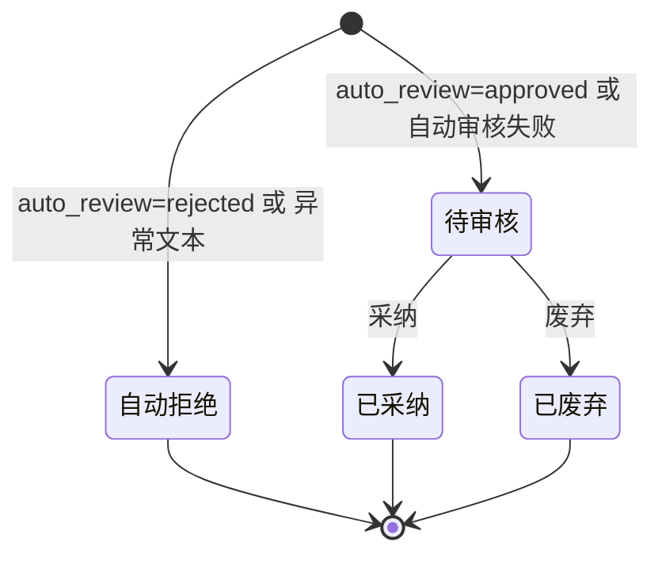
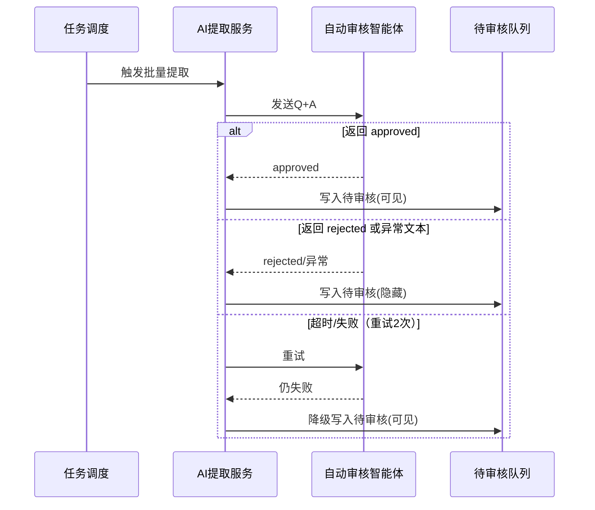

# 产品需求文档：AI自动预审核与审核队列分流 - V1.13

## 1. 综述 (Overview)
### 1.1 项目背景与核心问题
现有流程在 V1.5 已实现“对话提取为Q&A并进入人工审核队列”，但随着提取量增大，人工审核压力与噪音成本上升。为在不改变人工审核最终把关角色的前提下提升效率，需要在“AI提取”与“人工审核”之间新增一道自动预审核，对提取结果进行快速分流：通过的进入人工审核，未通过的隐藏留痕。该改动为逻辑微调，不涉及前端新页面或新交互。

### 1.2 核心业务流程 / 用户旅程地图
1.  **阶段一：对话预处理与Q&A提取** - 将对话聚合后提取为结构化Q&A。
2.  **阶段二：AI自动预审核** - 用固定智能体对Q&A做快速判定。
3.  **阶段三：审核队列分流** - 通过的进入人工审核队列，未通过的写入隐藏队列留痕。
4.  **阶段四：人工审核与入库** - 审核员采纳或废弃，采纳后入正式知识库。

### 1.3 Mermaid 图（流程/状态/时序）
> 说明：Mermaid 图用于“需求对齐”，避免歧义；避免写成技术实现细节（不要写 API 路径、字段、HTTP code、框架/库）。

#### 1.3.1 用户操作流（必填）
```mermaid
flowchart TD
  A[对话进入预处理] --> B[AI提取Q&A]
  B -->|无产出| C[结束/记录无产出]
  B -->|有Q&A| D[AI自动预审核]
  D -->|approved| E[进入待审核队列(可见)]
  D -->|rejected| F[进入待审核队列(隐藏)]
  E --> G[人工审核]
  G -->|采纳| H[正式知识库]
  G -->|废弃| I[记录废弃]
```

#### 1.3.2 状态机（当存在明确状态流转对象时必填）


#### 1.3.3 关键场景时序（仅当“时序/并发/重试/超时”影响用户可见结果时填写）


## 2. 用户故事详述 (User Stories)

### 阶段一：自动预审核与分流

---

#### **US-1.13.1: 作为后台系统，我希望对提取后的Q&A进行自动预审核，以便将合格内容送入人工审核并留痕被拒内容。**
*   **价值陈述 (Value Statement)**:
    *   **作为** 后台系统
    *   **我希望** 在AI提取后对Q&A进行自动预审核
    *   **以便于** 降低人工审核噪音，同时保留可追溯的拒绝记录。
*   **业务规则与逻辑 (Business Logic)**:
    1.  **前置条件**: Q&A已由提取任务生成。
    2.  **操作流程 (Happy Path)**:
        1. 系统调用一个固定的AICO自动审核智能体（不同于提取智能体）。
        2. 自动审核输入仅包含问题与答案（Q+A）。
        3. 智能体输出固定字面值 `approved` 或 `rejected`（去除首尾空白后解析）。
        4. 输出 `approved` 时，将该Q&A写入待审核队列并标记为可见。
        5. 输出 `rejected` 时，将该Q&A写入待审核队列并标记为隐藏。
    3.  **异常处理 (Error Handling)**:
        *   输出非 `approved/rejected` 的异常文本时，按 `rejected` 处理并隐藏。
        *   自动审核失败/超时的降级处理见 US-1.13.3。
*   **验收标准 (Acceptance Criteria)**:
    *   **场景1: 自动审核通过**
        *   **GIVEN** 提取任务产出一条Q&A
        *   **WHEN** 自动审核输出 `approved`
        *   **THEN** 该Q&A进入人工审核列表（可见）。
    *   **场景2: 自动审核拒绝**
        *   **GIVEN** 提取任务产出一条Q&A
        *   **WHEN** 自动审核输出 `rejected`
        *   **THEN** 该Q&A写入待审核队列但默认不展示。
    *   **场景3: 异常文本**
        *   **GIVEN** 自动审核返回非 `approved/rejected` 文本
        *   **WHEN** 系统解析输出
        *   **THEN** 该Q&A按 `rejected` 处理并隐藏。
---

### 阶段二：审核队列可见性

---

#### **US-1.13.2: 作为审核员，我希望审核列表仅展示待审核内容，以便专注处理需要人工介入的条目。**
*   **价值陈述 (Value Statement)**:
    *   **作为** 审核员
    *   **我希望** 只看到需要人工处理的待审核条目
    *   **以便于** 审核流程更清晰、操作更聚焦。
*   **业务规则与逻辑 (Business Logic)**:
    1.  **前置条件**: 用户已登录并进入审核工作台。
    2.  **操作流程 (Happy Path)**:
        1. 审核列表默认仅展示“待审核”状态的条目。
        2. 自动预审核拒绝的条目不在列表中展示，也不提供筛选入口。
        3. 单条采纳/废弃与批量采纳/废弃仅作用于待审核条目。
    3.  **异常处理 (Error Handling)**:
        *   若列表加载失败，沿用现有提示文案与刷新机制。
*   **验收标准 (Acceptance Criteria)**:
    *   **场景1: 列表可见性**
        *   **GIVEN** 待审核队列中同时存在可见与隐藏条目
        *   **WHEN** 审核员进入审核工作台
        *   **THEN** 仅可见条目出现在列表中。
    *   **场景2: 操作范围**
        *   **GIVEN** 列表中存在多条待审核记录
        *   **WHEN** 审核员执行单条或批量操作
        *   **THEN** 仅待审核记录被处理，隐藏条目不受影响。
---
*   **页面布局线框图 (ASCII Wireframe)**:
    ```text
    +----------------------------------------------------------------------------------+
    | FAQ 智能挖掘系统      当前知识库: [ 水务知识库 ]                     [用户: 审核员] |
    +==================================================================================+
    | 审核工作台（仅展示“待审核”）                                                     |
    |----------------------------------------------------------------------------------|
    | +------------------------------------+--------------------------------+---------+ |
    | | 问题摘要                           | 答案摘要                       | 操作    | |
    | +------------------------------------+--------------------------------+---------+ |
    | | ...                                | ...                            | [采纳] | |
    | +------------------------------------+--------------------------------+---------+ |
    | 说明：自动预审核拒绝(auto_rejected)不在列表中展示，也不提供筛选入口。               |
    +----------------------------------------------------------------------------------+
    ```
---

### 阶段三：异常与重试

---

#### **US-1.13.3: 作为后台系统，我希望自动审核在失败时可重试并降级，以便保证人工审核不被阻断。**
*   **价值陈述 (Value Statement)**:
    *   **作为** 后台系统
    *   **我希望** 在自动审核失败时按预期重试并降级
    *   **以便于** 自动审核的不稳定不会阻断人工审核流程。
*   **业务规则与逻辑 (Business Logic)**:
    1.  **前置条件**: 自动审核被触发处理某条Q&A。
    2.  **操作流程 (Happy Path)**:
        1. 单次自动审核调用超时阈值为10秒。
        2. 失败后重试2次，每次间隔5秒。
        3. 若仍失败，则降级进入人工审核队列（可见）。
        4. 单条失败不影响同批次其它条目处理。
    3.  **异常处理 (Error Handling)**:
        *   所有失败仅记录任务日志，不额外落库错误详情。
*   **验收标准 (Acceptance Criteria)**:
    *   **场景1: 失败降级**
        *   **GIVEN** 自动审核对某条Q&A连续失败
        *   **WHEN** 达到重试上限
        *   **THEN** 该Q&A进入人工审核列表（可见）。
    *   **场景2: 批量不中断**
        *   **GIVEN** 同批次中一条Q&A审核失败
        *   **WHEN** 系统继续处理该批次
        *   **THEN** 其它Q&A仍按自动审核结果分流。
```
