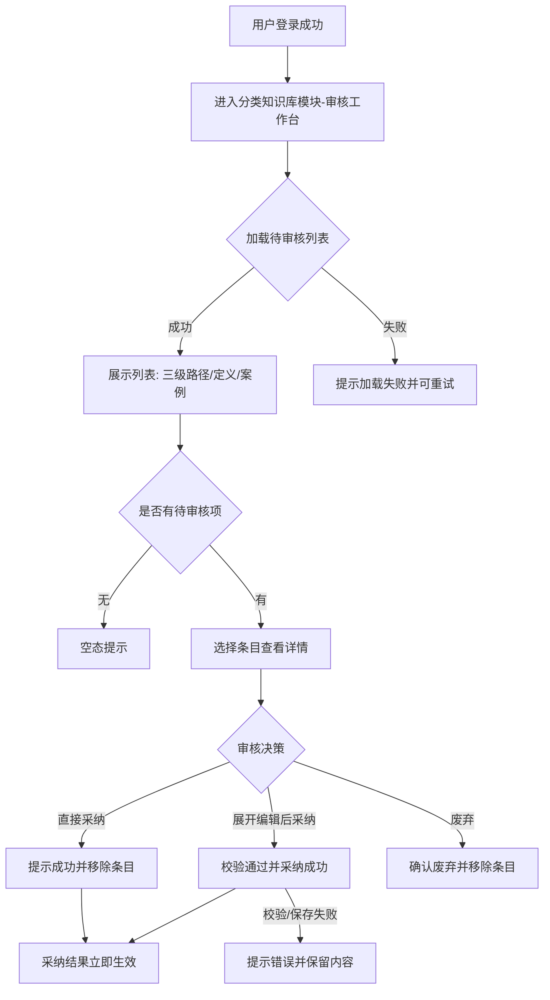
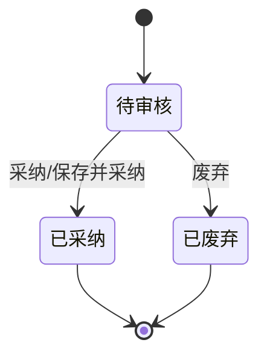

# 产品需求文档：三级分类审核工作台 - V1.14

## 1. 综述 (Overview)
### 1.1 项目背景与核心问题
V1.12 已引入“分类知识库”模块，用于维护**三级分类体系**及其**定义与案例**。但当前缺少针对该内容的人工审核环节，容易产生定义不准、案例不可信或分类边界不清的问题。为保证分类知识库的准确性与一致性，需要引入一套**与现有“知识库审核工作台”一致的审核交互**，对“三级分类（名称+定义+案例）”进行集中审核。

本版本目标是在“分类知识库模块”内新增**审核工作台**页面，实现待审核列表展示、内联展开编辑、采纳与废弃，并确保采纳结果可立即生效到“三级分类知识库”页面。

**范围与非目标**:
1.  本版本**不定义**审核触发来源与入队规则（由后续方案决定）。
2.  **不包含**批量审核能力。
3.  **不包含**列表搜索/筛选/排序/分页能力。
4.  **不支持**修改一级/二级路径，仅可编辑三级名称/定义/案例。
5.  **不提供**已审核历史记录页面或状态回查。

### 1.2 核心业务流程 / 用户旅程地图
1.  **阶段一：进入审核工作台** - 用户进入“分类知识库模块”下的“审核工作台”页面。
2.  **阶段二：浏览待审核列表** - 用户查看待审核三级分类的路径、定义与案例内容。
3.  **阶段三：审核决策** - 用户直接采纳、展开编辑后采纳或废弃该审核项。
4.  **阶段四：结果生效** - 采纳结果立即在“三级分类知识库”页面生效，废弃项从列表移除。

### 1.3 Mermaid 图（流程/状态/时序）
> 说明：Mermaid 图用于“需求对齐”，避免歧义；避免写成技术实现细节（不要写 API 路径、字段、HTTP code、框架/库）。

#### 1.3.1 用户操作流（必填）


#### 1.3.2 状态机（当存在明确状态流转对象时必填）


## 2. 用户故事详述 (User Stories)

### 阶段一：进入审核工作台与加载列表

---

#### **US-14.1: 作为一名审核员，我希望能在分类知识库模块中进入审核工作台并查看待审核列表，以便集中审核三级分类的名称/定义/案例。**
*   **价值陈述 (Value Statement)**:
    *   **作为** 审核员
    *   **我希望** 在分类知识库模块内进入审核工作台并查看待审核列表
    *   **以便于** 快速定位需要审核的三级分类并开始审核。
*   **业务规则与逻辑 (Business Logic)**:
    1.  **前置条件**: 用户已登录；系统已识别其所属业务场景（如水务/公交）。
    2.  **入口与导航**:
        *   在侧边栏“分类知识库模块”下新增入口 **审核工作台**，与“三级分类知识库”并列。
    3.  **场景隔离**:
        *   **水务场景**: 不展示页签，直接显示水务待审核列表。
        *   **公交场景**: 展示页签 `公交` 与 `自行车`，页签内数据相互隔离。
    4.  **列表字段与展示规则**:
        *   列表仅展示三列：`三级分类路径(一级/二级/三级)`、`定义(全文)`、`案例(全文)`。
        *   定义与案例为**全量展示**，单元格自动换行，列表可纵向滚动。
        *   不提供搜索/筛选/排序/分页能力。
        *   每条审核项提供操作按钮：`[✔采纳] [展开] [✖废弃]`（与现有审核工作台一致）。
    5.  **空态与异常**:
        *   无待审核数据时提示“暂无待审核分类”。
        *   加载失败时提示“加载失败，请重试”，并提供重试入口。
*   **验收标准 (Acceptance Criteria)**:
    *   **场景1: 水务场景进入**
        *   **GIVEN** 我以水务场景账号登录
        *   **WHEN** 我进入“分类知识库模块-审核工作台”
        *   **THEN** 页面不展示页签，列表仅显示水务待审核数据。
    *   **场景2: 公交场景页签隔离**
        *   **GIVEN** 我以公交场景账号登录
        *   **WHEN** 我切换“公交/自行车”页签
        *   **THEN** 列表数据随页签切换而变化，不应混入其他场景数据。
    *   **场景3: 列表字段展示**
        *   **GIVEN** 列表中存在待审核项
        *   **WHEN** 我查看列表
        *   **THEN** 我能看到三级路径、定义全文与案例全文，且内容自动换行展示。
    *   **场景4: 空态与加载失败**
        *   **GIVEN** 当前无待审核数据
        *   **WHEN** 我进入审核工作台
        *   **THEN** 页面提示“暂无待审核分类”。
        *   **GIVEN** 列表加载失败
        *   **WHEN** 页面展示错误状态
        *   **THEN** 提示“加载失败，请重试”并允许重试加载。
---
*   **页面布局线框图 (ASCII Wireframe)**:
    ```text
    +----------------------------------------------------------------------------------------------+
    | 水务智能知识库系统  | QA审核模块 | 分类知识库模块(当前) | ... | 用户信息/退出                |
    +----------------------------------------------------------------------------------------------+
    | 侧边栏                                                                              主内容   |
    | +------------------------------+-----------------------------------------------------------+ |
    | | QA审核模块                   |  分类知识库审核工作台                                     | |
    | |  - 审核工作台                |  （公交场景：页签 [公交] [自行车]；水务场景无页签）        | |
    | |  - QA知识库管理              |-----------------------------------------------------------| |
    | |                              |  列表：待审核三级分类                                     | |
    | | 分类知识库模块               |  +----------------------+----------------+--------------+ |
    | |  - 审核工作台 (新增)          |  | 三级分类(1/2/3路径)   | 定义(全量)     | 案例(全量)   | |
    | |  - 三级分类知识库             |  +----------------------+----------------+--------------+ |
    | |                              |  | 查询咨询/水费/水量    | ...定义全文... | 案例1全文... | |
    | |                              |  |                      |                | 案例2全文... | |
    | |                              |  |                      |                | 案例3全文... | |
    | |                              |  |                      |                | [✔采纳][展开][✖废弃] |
    | |                              |  +--------------------------------------------------------+ |
    | +------------------------------+-----------------------------------------------------------+ |
    +----------------------------------------------------------------------------------------------+
    ```

### 阶段二：审核决策与内容编辑

---

#### **US-14.2: 作为一名审核员，我希望能在列表内联展开并编辑三级分类内容后采纳或废弃，以便高效完成审核。**
*   **价值陈述 (Value Statement)**:
    *   **作为** 审核员
    *   **我希望** 在列表内联展开编辑三级名称/定义/案例并完成采纳或废弃
    *   **以便于** 快速完成审核并确保内容准确。
*   **业务规则与逻辑 (Business Logic)**:
    1.  **展开与并发限制**:
        *   点击 `[展开]` 在当前行下方以内联方式展开编辑区域。
        *   同一时间仅允许**一条**审核项处于展开状态。
    2.  **可编辑范围**:
        *   允许编辑：`三级名称`、`定义`、`案例全文`。
        *   允许新增/删除案例。
        *   **不允许**修改所属一级/二级路径。
    3.  **校验规则**:
        *   三级名称必填、定义必填。
        *   至少保留 1 条案例，每条案例全文必填。
        *   校验失败时提示错误并阻止保存。
    4.  **审核操作**:
        *   **直接采纳**: 点击 `[✔采纳]`，不展开编辑。
        *   **编辑后采纳**: 在展开区点击 `[保存并采纳]`。
        *   **废弃**: 点击 `[✖废弃]`，确认逻辑与现有审核工作台一致。
    5.  **结果与反馈**:
        *   采纳/废弃成功后，提示成功并从列表中移除该项。
        *   采纳成功后，内容**立即**在“三级分类知识库”页面生效可见。
        *   保存失败时，提示错误并保留当前输入内容以便重试。
*   **验收标准 (Acceptance Criteria)**:
    *   **场景1: 仅允许单条展开**
        *   **GIVEN** 列表中已展开一条审核项
        *   **WHEN** 我展开另一条
        *   **THEN** 页面仅保留一条展开状态。
    *   **场景2: 校验失败**
        *   **GIVEN** 我在展开编辑中清空了三级名称或定义
        *   **WHEN** 我点击“保存并采纳”
        *   **THEN** 系统提示校验错误并阻止提交。
    *   **场景3: 编辑后采纳成功**
        *   **GIVEN** 我编辑了三级名称/定义/案例并点击“保存并采纳”
        *   **WHEN** 保存成功
        *   **THEN** 该条目从列表移除，且在“三级分类知识库”页面立即可见。
    *   **场景4: 直接采纳**
        *   **GIVEN** 我未展开编辑
        *   **WHEN** 我点击“✔采纳”
        *   **THEN** 系统提示成功并移除该条目。
    *   **场景5: 废弃**
        *   **GIVEN** 我点击“✖废弃”
        *   **WHEN** 确认操作并成功
        *   **THEN** 系统提示成功并移除该条目。
    *   **场景6: 保存失败**
        *   **GIVEN** 我点击“保存并采纳”
        *   **WHEN** 保存失败
        *   **THEN** 系统提示失败原因并保留当前编辑内容。
---
*   **页面布局线框图 (ASCII Wireframe)**:
    ```text
    +----------------------------------------------------------------------------------------------+
    | 列表行已展开                                                                                  |
    | +------------------------------------------------------------------------------------------+ |
    | | 三级名称： [_________________________]                                                    | |
    | | 定义：     [ 多行文本输入............................................................... ] | |
    | | 案例列表：                                                                             | |
    | |  - 案例#1 [ 多行文本输入............................................................... ] [删除] |
    | |  - 案例#2 [ 多行文本输入............................................................... ] [删除] |
    | |  [ + 新增案例 ]                                                                          | |
    | |                                                   [保存并采纳] [取消]                   | |
    | +------------------------------------------------------------------------------------------+ |
    +----------------------------------------------------------------------------------------------+
    ```
