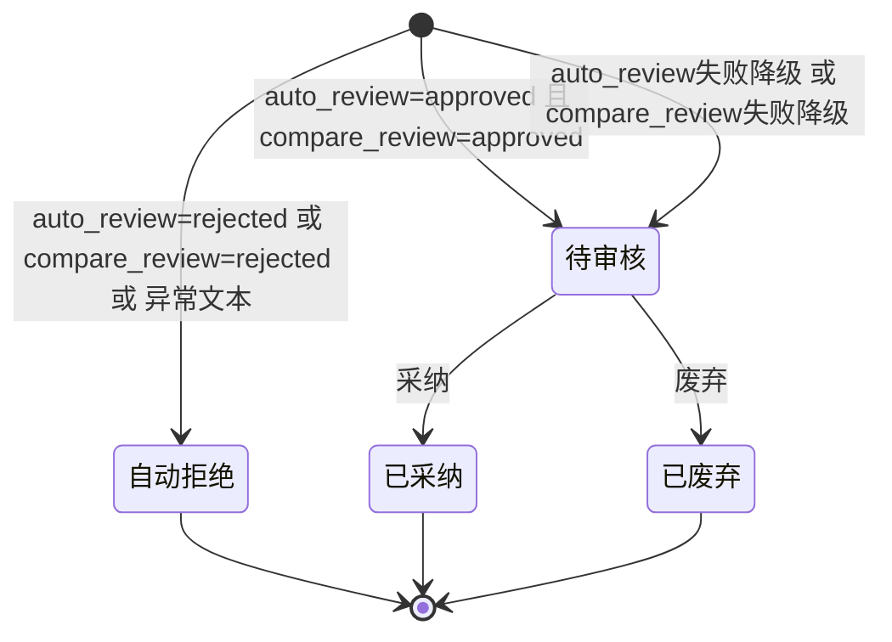
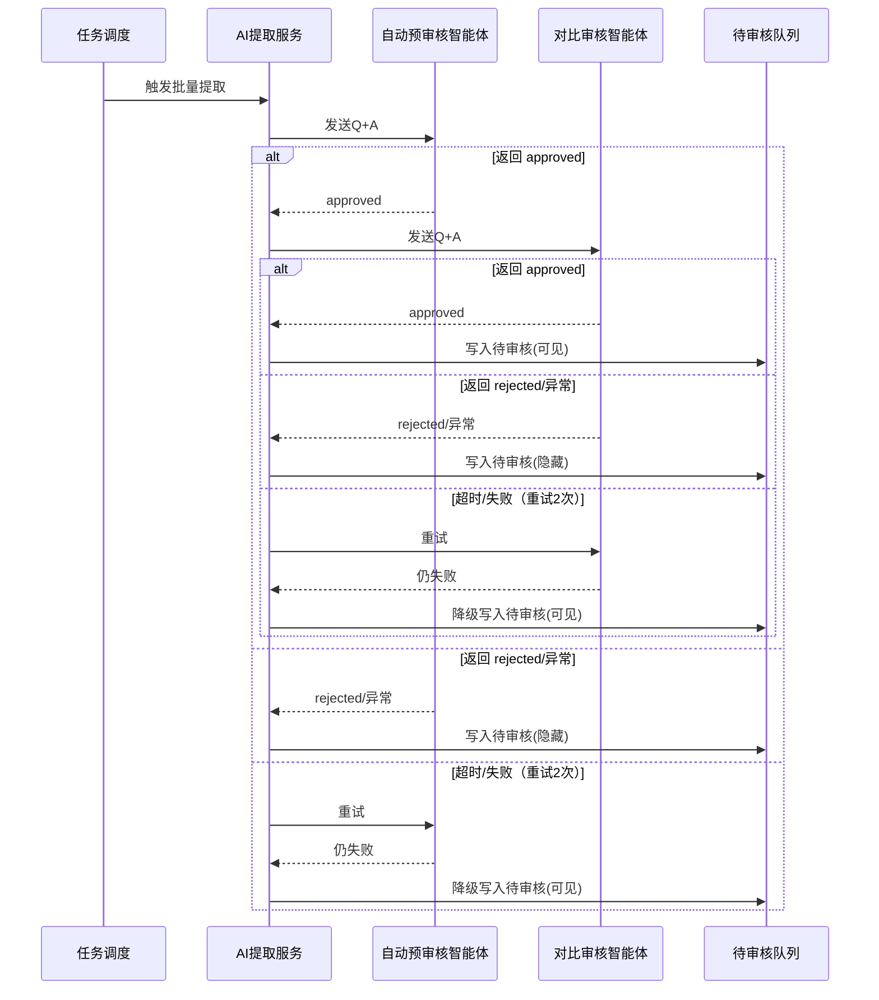

# 产品需求文档：AI对比审核与对比知识库同步 - V1.15

## 1. 综述 (Overview)
### 1.1 项目背景与核心问题
V1.13 已在“AI提取”与“人工审核”之间新增自动预审核，有效降低了人工噪音。但待审核列表仍可能出现语义重复或冲突的内容，影响审核效率与一致性。V1.15 在不改变人工审核最终把关角色的前提下，再增加一层“对比审核”：对自动预审核通过的Q&A进行对比判定，进一步过滤重复/冲突内容。同时，为对比审核提供稳定数据源，需要新增“对比知识库”的定时同步，采用全量覆盖式更新并与现有批量流程对齐。整体为后台逻辑扩展，不新增前端页面或交互。

### 1.2 核心业务流程 / 用户旅程地图
1.  **阶段一：对话预处理与Q&A提取** - 将对话聚合后提取为结构化Q&A。
2.  **阶段二：AI自动预审核** - 对Q&A做快速判定，筛除明显不合格条目。
3.  **阶段三：对比审核** - 仅对自动预审核通过的条目进行对比判定，进一步分流。
4.  **阶段四：人工审核与入库** - 审核员采纳或废弃，采纳后入正式知识库。

### 1.3 Mermaid 图（流程/状态/时序）
> 说明：Mermaid 图用于“需求对齐”，避免歧义；避免写成技术实现细节（不要写 API 路径、字段、HTTP code、框架/库）。

#### 1.3.1 用户操作流（必填）
```mermaid
flowchart TD
  A[对话进入预处理] --> B[AI提取Q&A]
  B -->|无产出| C[结束/记录无产出]
  B -->|有Q&A| D[AI自动预审核]
  D -->|approved| E[对比审核]
  D -->|rejected/异常| F[写入待审核(隐藏)]
  D -->|超时/失败(重试后降级)| G[写入待审核(可见)]
  E -->|approved| G
  E -->|rejected/异常| F
  E -->|超时/失败(重试后降级)| G
  G --> H[人工审核]
  H -->|采纳| I[正式知识库]
  H -->|废弃| J[记录废弃]
  K[对比知识库定时同步\n(全量覆盖, 每日定时)] -.-> E
```

#### 1.3.2 状态机（当存在明确状态流转对象时必填）


#### 1.3.3 关键场景时序（仅当“时序/并发/重试/超时”影响用户可见结果时填写）


## 2. 用户故事详述 (User Stories)

### 阶段一：对比审核与分流

---

#### **US-1.15.1: 作为后台系统，我希望对自动预审核通过的Q&A进行对比审核，以便进一步过滤重复或冲突内容。**
*   **价值陈述 (Value Statement)**:
    *   **作为** 后台系统
    *   **我希望** 在自动预审核通过后执行对比审核
    *   **以便于** 降低待审核列表的重复与冲突，提升人工审核效率。
*   **业务规则与逻辑 (Business Logic)**:
    1.  **前置条件**: Q&A已完成自动预审核且结果为 `approved`。
    2.  **操作流程 (Happy Path)**:
        1. 系统调用独立的AICO对比审核智能体（与自动预审核智能体不同）。
        2. 对比审核输入仅包含当前条目问题与答案（Q+A）。
        3. 智能体输出固定字面值 `approved` 或 `rejected`（去除首尾空白后解析）。
        4. 输出 `approved` 时，该Q&A进入待审核队列并标记为可见。
        5. 输出 `rejected` 时，该Q&A写入待审核队列但标记为隐藏。
    3.  **异常处理 (Error Handling)**:
        *   输出非 `approved/rejected` 的异常文本时，按 `rejected` 处理并隐藏。
        *   对比审核失败/超时的降级处理见 US-1.15.3。
*   **验收标准 (Acceptance Criteria)**:
    *   **场景1: 对比审核通过**
        *   **GIVEN** 一条Q&A已自动预审核通过
        *   **WHEN** 对比审核输出 `approved`
        *   **THEN** 该Q&A进入人工审核列表（可见）。
    *   **场景2: 对比审核拒绝**
        *   **GIVEN** 一条Q&A已自动预审核通过
        *   **WHEN** 对比审核输出 `rejected`
        *   **THEN** 该Q&A写入待审核队列但默认不展示。
    *   **场景3: 异常文本**
        *   **GIVEN** 对比审核返回非 `approved/rejected` 文本
        *   **WHEN** 系统解析输出
        *   **THEN** 该Q&A按 `rejected` 处理并隐藏。
---

### 阶段二：对比知识库同步

---

#### **US-1.15.2: 作为后台系统，我希望将可见待审核Q&A定时同步到对比知识库，以便对比审核有稳定的数据源。**
*   **价值陈述 (Value Statement)**:
    *   **作为** 后台系统
    *   **我希望** 定时将可见待审核Q&A同步到对比知识库
    *   **以便于** 为对比审核提供持续更新、可追溯的对比基准。
*   **业务规则与逻辑 (Business Logic)**:
    1.  **前置条件**:
        *   AICO侧已创建对比审核专用项目与知识库。
        *   系统新增对比审核专用 `scenario` 配置行：`water_compare` 与 `bus_compare`，并填入各自的AICO项目与知识库名。
    2.  **操作流程 (Happy Path)**:
        1. 每日定时批量流程完成后，系统触发对比知识库同步任务。
        2. 同步数据源为“同场景可见待审核Q&A”。
        3. 同步流程复用既有AICO知识库同步编排逻辑（先删后增，全量覆盖）。
        4. 水务与公交分别使用各自的 `scenario` 配置行，互不覆盖。
    3.  **异常处理 (Error Handling)**:
        *   同步失败时仅记录日志并保留上一次成功快照，对比审核继续执行。
*   **验收标准 (Acceptance Criteria)**:
    *   **场景1: 同步成功**
        *   **GIVEN** 当日流程完成且存在可见待审核Q&A
        *   **WHEN** 对比知识库同步任务执行成功
        *   **THEN** AICO对比知识库内容与系统中“可见待审核Q&A”一致（全量覆盖）。
    *   **场景2: 同步失败**
        *   **GIVEN** 对比知识库同步任务失败
        *   **WHEN** 系统记录错误日志
        *   **THEN** 对比审核仍可使用上一次成功同步的知识库快照继续执行。
---

### 阶段三：异常与重试

---

#### **US-1.15.3: 作为后台系统，我希望对比审核在失败时可重试并降级，以便保证人工审核不被阻断。**
*   **价值陈述 (Value Statement)**:
    *   **作为** 后台系统
    *   **我希望** 在对比审核失败时按预期重试并降级
    *   **以便于** 对比审核不稳定不会阻断人工审核流程。
*   **业务规则与逻辑 (Business Logic)**:
    1.  **前置条件**: 对比审核被触发处理某条Q&A。
    2.  **操作流程 (Happy Path)**:
        1. 单次对比审核调用超时阈值为10秒。
        2. 失败后重试2次，每次间隔5秒。
        3. 若仍失败，则降级进入人工审核队列（可见）。
        4. 单条失败不影响同批次其它条目处理。
    3.  **异常处理 (Error Handling)**:
        *   所有失败仅记录任务日志，不额外落库错误详情。
*   **验收标准 (Acceptance Criteria)**:
    *   **场景1: 失败降级**
        *   **GIVEN** 对比审核对某条Q&A连续失败
        *   **WHEN** 达到重试上限
        *   **THEN** 该Q&A进入人工审核列表（可见）。
    *   **场景2: 批量不中断**
        *   **GIVEN** 同批次中一条Q&A对比审核失败
        *   **WHEN** 系统继续处理该批次
        *   **THEN** 其它Q&A仍按对比审核结果分流。
