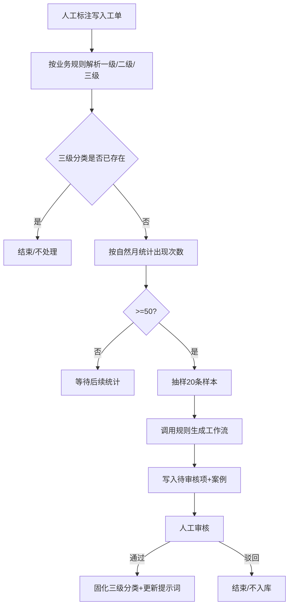
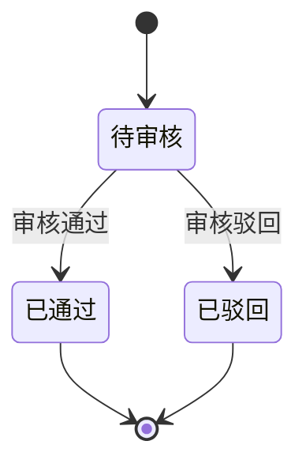

# 产品需求文档：三级分类规则化沉淀与审核触发 - V1.16

## 1. 综述 (Overview)
### 1.1 项目背景与核心问题
已实现三级分类审核逻辑，但当前缺少稳定的三级分类数据产出入口，导致审核流程难以被持续触发与沉淀。业务侧的三级分类主要由人工标注产生，且在实际工单中重复出现。V1.16 需要基于人工标注数据进行统计监控，在满足阈值时触发规则化沉淀流程，通过模型辅助生成候选规则，再由人工审核固化并更新提示词配置。整体为后台逻辑扩展，不新增前端页面或交互。

### 1.2 核心业务流程 / 用户旅程地图
1.  **阶段一：人工标注产出** - 从工单中提取人工标注的三级分类数据。
2.  **阶段二：存在性比对** - 仅对“库里不存在”的三级分类进入后续统计。
3.  **阶段三：阈值触发** - 按自然月统计同名三级分类出现次数，达阈值才触发。
4.  **阶段四：规则生成与候选入库** - 抽样样本，调用工作流生成规则并写入待审核表。
5.  **阶段五：人工审核与固化** - 审核通过后固化分类并更新提示词。

### 1.3 Mermaid 图（流程/状态/时序）
> 说明：Mermaid 图用于“需求对齐”，避免歧义；避免写成技术实现细节（不要写 API 路径、字段、HTTP code、框架/库）。

#### 1.3.1 用户操作流（必填）

#### 1.3.2 状态机（当存在明确状态流转对象时必填）

## 2. 用户故事详述 (User Stories)

### 阶段一：候选三级分类识别与阈值触发

---

#### **US-1.16.1: 作为后台系统，我希望从工单中提取三级分类并进行阈值判断，以便触发规则化沉淀流程。**
*   **价值陈述 (Value Statement)**:
    *   **作为** 后台系统
    *   **我希望** 解析人工标注的三级分类并按自然月统计
    *   **以便于** 仅对稳定高频的三级分类进入规则化沉淀流程。
*   **业务规则与逻辑 (Business Logic)**:
    1.  **前置条件**:
        *   数据源为 `work_order` 表，统计时间字段为 `update_time`（自然月口径）。
        *   需用到字段：`group_code`、`nature`、`ticket_type`、`work_order_type_details`、`appeal_content`。
    2.  **操作流程 (Happy Path)**:
        1. 按自然月扫描 `work_order` 记录并解析分类层级。
        2. 水务（`group_code=1`）：一级=`nature`，二级=`ticket_type`，三级=`work_order_type_details`，`scope_code=water`。
        3. 公交（`group_code=2`）仅处理 `ticket_type` 为 JSON 数组字符串的记录：
           * `nature=自行车` 且数组长度=2：二级=arr[0]，三级=arr[1]，`scope_code=bike`。
           * `nature=公交` 且数组长度=3：二级=arr[0]，三级=arr[2]，`scope_code=bus`。
        4. 仅对“库里不存在”的三级分类进入统计：与 `kb_taxonomy_nodes` 比对名称是否存在。
           * water：`scope_code=water` 且 `level=3` 按 `name` 比对。
           * bus：`scope_code=bus` 且 `level=3` 按 `name` 比对。
           * bike：`scope_code=bike` 且 `level=2` 按 `name` 比对。
        5. 对同名三级分类按自然月统计出现次数（按 `work_order` 记录数），次数≥50 触发候选生成。
    3.  **异常处理 (Error Handling)**:
        *   公交记录 `ticket_type` 非 JSON 数组字符串或数组长度不匹配时直接跳过。
        *   `group_code=2` 且 `nature` 非“公交/自行车”时跳过。
*   **验收标准 (Acceptance Criteria)**:
    *   **场景1: 水务三级分类触发**
        *   **GIVEN** 某水务三级分类在上月出现次数≥50且库里不存在
        *   **WHEN** 批处理统计完成
        *   **THEN** 该三级分类进入候选生成流程。
    *   **场景2: 已存在三级分类**
        *   **GIVEN** 该三级分类名称已存在于 `kb_taxonomy_nodes`
        *   **WHEN** 批处理统计完成
        *   **THEN** 系统不触发该分类的候选生成。
    *   **场景3: 公交数据格式异常**
        *   **GIVEN** 公交记录的 `ticket_type` 非 JSON 数组或长度不匹配
        *   **WHEN** 系统解析分类层级
        *   **THEN** 该记录被跳过且不参与统计。
---

### 阶段二：规则生成与候选入库

---

#### **US-1.16.2: 作为后台系统，我希望按月调用规则生成工作流并写入待审核，以便输出可被审核的三级分类规则。**
*   **价值陈述 (Value Statement)**:
    *   **作为** 后台系统
    *   **我希望** 对触发的候选分类生成规则并写入审核表
    *   **以便于** 让人工审核能够快速确认并固化三级分类口径。
*   **业务规则与逻辑 (Business Logic)**:
    1.  **前置条件**:
        *   候选三级分类已由 US-1.16.1 触发。
        *   每月 1 号批处理统计上一个自然月。
    2.  **操作流程 (Happy Path)**:
        1. 对每个候选三级分类，从上月样本中随机抽取 20 条 `appeal_content`（不足 20 则全量）。
        2. 组装提示词：`l1/l2/l3 + 20条样本文本`。
        3. 调用 AICO 规则生成接口并解析 `data.text[0]` 为规则文本。
           * Endpoint: `POST http://20.17.39.132:11105/aicoapi/gateway/v2/chatbot/api_run/1768990846_34d4efbc-430d-485f-8aa1-67bf1e50028d`
           * Headers: `Content-Type: application/json`，`Authorization: Bearer {api_key}`
           * Body: `{"query": "<prompt>", "stream": false}`
        4. 将候选写入 `kb_taxonomy_review_items`：
           * `scope_code`、`l1_name`、`l2_name`、`l3_name`（提取到的三级名称）、`definition`（规则文本）、`status=pending`。
        5. 将 20 条样本写入 `kb_taxonomy_review_cases.content`。
    3.  **异常处理 (Error Handling)**:
        *   若已存在同 `scope_code + l3_name` 且 `status` 为 `pending/accepted` 的审核项，则跳过本次生成；`discarded` 允许后续再次进入。
        *   抽样不足 20 条时全量写入，不视为异常。
*   **验收标准 (Acceptance Criteria)**:
    *   **场景1: 候选生成成功**
        *   **GIVEN** 某三级分类触发候选且无重复审核项
        *   **WHEN** 批处理调用规则生成工作流
        *   **THEN** `kb_taxonomy_review_items` 生成一条待审核记录，且 `kb_taxonomy_review_cases` 写入 20 条样本。
    *   **场景2: 重复候选**
        *   **GIVEN** 已存在同 `scope_code+l3_name` 的 `pending/accepted` 审核项
        *   **WHEN** 批处理尝试生成
        *   **THEN** 系统跳过该分类且不新增审核记录。
    *   **场景3: 样本不足**
        *   **GIVEN** 上月样本不足 20 条
        *   **WHEN** 系统抽样
        *   **THEN** 仅写入现有全部样本。
---

### 阶段三：人工审核与固化

---

#### **US-1.16.3: 作为审核员，我希望沿用既有审核流程审查候选规则，以便将有效三级分类固化并更新提示词。**
*   **价值陈述 (Value Statement)**:
    *   **作为** 审核员
    *   **我希望** 在现有审核工作台查看候选规则和样本
    *   **以便于** 统一口径并将有效规则固化到正式分类体系。
*   **业务规则与逻辑 (Business Logic)**:
    1.  **前置条件**: `kb_taxonomy_review_items.status=pending` 且存在对应案例。
    2.  **操作流程 (Happy Path)**:
        1. 审核员查看候选的 `l1/l2/l3` 路径、规则文本及案例。
        2. 审核通过后，系统将三级分类及规则固化至正式分类表，并同步案例。
        3. 审核通过后，提示词由人工在既有配置位置更新，格式仅包含“三级分类名称”一段文本。
        4. 审核驳回则仅更新审核状态，不写入正式分类表。
    3.  **异常处理 (Error Handling)**:
        *   已处理的审核项（非 `pending`）不可再次操作。
*   **验收标准 (Acceptance Criteria)**:
    *   **场景1: 审核通过**
        *   **GIVEN** 一条待审核三级分类规则
        *   **WHEN** 审核员点击通过
        *   **THEN** 该分类固化到正式分类表，审核项状态为 `accepted`，提示词按“三级分类名称”更新。
    *   **场景2: 审核驳回**
        *   **GIVEN** 一条待审核三级分类规则
        *   **WHEN** 审核员点击驳回
        *   **THEN** 审核项状态为 `discarded`，不写入正式分类表。
    *   **场景3: 重复操作**
        *   **GIVEN** 审核项已为 `accepted` 或 `discarded`
        *   **WHEN** 再次尝试操作
        *   **THEN** 系统拒绝该操作。
