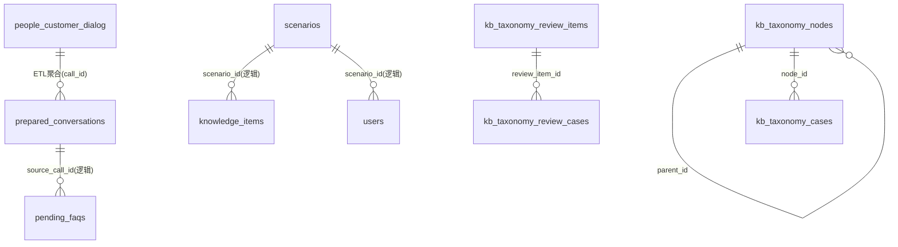

# 数据库表说明

## 1. 范围与约定
- 目标数据库：MySQL（ENGINE=InnoDB，DEFAULT CHARSET=utf8mb4）。
- 本系统自建表：包含下文所有带 `CREATE TABLE` 的表。
- 外部数据源表 `people_customer_dialog`：只读，不由本系统创建，仅说明结构与关系。

## 2. 系统自建表清单
- prepared_conversations：对话预处理汇总表
- pending_faqs：待审核FAQ表
- knowledge_items：正式知识库表
- scenarios：多场景配置表
- users：用户账户表
- kb_taxonomy_nodes：分类知识库节点表
- kb_taxonomy_cases：分类知识库案例表
- kb_taxonomy_review_items：分类审核候选条目表
- kb_taxonomy_review_cases：分类审核候选案例表

## 3. 系统自建表（用途说明 + DDL）

### prepared_conversations
用途：将源库 `people_customer_dialog` 中同一 `call_id` 的对话聚合为可读全文，作为AI处理入口。

```sql
CREATE TABLE IF NOT EXISTS prepared_conversations (
  id BIGINT NOT NULL AUTO_INCREMENT COMMENT '主键',
  group_code VARCHAR(4) NOT NULL COMMENT '场景编码/业务域',
  call_id VARCHAR(64) NOT NULL COMMENT '唯一的通话ID',
  full_text LONGTEXT NOT NULL COMMENT '聚合与格式化后的完整对话文本',
  status VARCHAR(20) NOT NULL DEFAULT 'unprocessed' COMMENT 'unprocessed|processing|completed|failed|processed_no_faq',
  conversation_time DATETIME NULL COMMENT '对话发生时间(取该call_id首条记录的create_time)',
  created_at DATETIME NOT NULL DEFAULT CURRENT_TIMESTAMP COMMENT '创建时间',
  PRIMARY KEY (id),
  UNIQUE KEY uk_prepared_conversations_call_id (call_id)
) ENGINE=InnoDB DEFAULT CHARSET=utf8mb4 COMMENT='预处理完成的对话表，等待AI加工';
```

### pending_faqs
用途：存放AI从对话中提取的待审核Q&A，等待人工审核处理。

```sql
CREATE TABLE IF NOT EXISTS pending_faqs (
  id BIGINT NOT NULL AUTO_INCREMENT COMMENT '主键',
  question TEXT NOT NULL COMMENT 'AI提取的原始问题',
  answer TEXT NOT NULL COMMENT 'AI提取的原始答案',
  status VARCHAR(20) NOT NULL DEFAULT 'pending' COMMENT 'pending|processed|discarded|auto_rejected',
  source_group_code VARCHAR(2) NULL COMMENT '来源场景编码',
  source_call_id VARCHAR(64) NULL COMMENT '来源对话的call_id',
  source_conversation_text LONGTEXT NULL COMMENT '聚合后的原始对话全文',
  created_at DATETIME NOT NULL DEFAULT CURRENT_TIMESTAMP COMMENT '创建时间',
  updated_at DATETIME NOT NULL DEFAULT CURRENT_TIMESTAMP ON UPDATE CURRENT_TIMESTAMP COMMENT '更新时间',
  PRIMARY KEY (id)
) ENGINE=InnoDB DEFAULT CHARSET=utf8mb4 COMMENT='待审核的FAQ表';
```

### knowledge_items
用途：存放审核通过后的标准Q&A，作为正式知识库数据源。

```sql
CREATE TABLE IF NOT EXISTS knowledge_items (
  id BIGINT NOT NULL AUTO_INCREMENT COMMENT '唯一主键',
  scenario_id INT NOT NULL COMMENT '所属场景ID，对应scenarios表',
  question TEXT NOT NULL COMMENT '审核通过后的标准问题',
  answer TEXT NOT NULL COMMENT '审核通过后的标准答案',
  status VARCHAR(20) NOT NULL DEFAULT 'active' COMMENT 'active|disabled',
  created_at DATETIME NOT NULL DEFAULT CURRENT_TIMESTAMP COMMENT '创建时间',
  updated_at DATETIME NOT NULL DEFAULT CURRENT_TIMESTAMP ON UPDATE CURRENT_TIMESTAMP COMMENT '更新时间',
  PRIMARY KEY (id),
  KEY idx_knowledge_items_scenario_id (scenario_id)
) ENGINE=InnoDB DEFAULT CHARSET=utf8mb4 COMMENT='正式知识库表(事实源头)';
```

### scenarios
用途：管理不同业务场景的AICO配置与同步策略。

```sql
CREATE TABLE IF NOT EXISTS scenarios (
  id INT NOT NULL AUTO_INCREMENT COMMENT '主键',
  scenario_code VARCHAR(50) NOT NULL COMMENT '场景编码',
  scenario_name VARCHAR(100) NOT NULL COMMENT '场景名称',
  is_active TINYINT(1) NOT NULL DEFAULT 1 COMMENT '是否启用',
  source_group_code VARCHAR(2) NULL COMMENT '映射源系统group_code',
  aico_username VARCHAR(100) NOT NULL COMMENT 'AICO账号用户名',
  aico_user_id INT NOT NULL COMMENT 'AICO账号ID',
  aico_project_name VARCHAR(100) NOT NULL COMMENT 'AICO项目名称',
  aico_kb_name VARCHAR(100) NOT NULL COMMENT 'AICO知识库名称',
  aico_host VARCHAR(255) NULL COMMENT 'AICO服务地址(可区分环境)',
  aico_cached_pid INT NULL COMMENT 'AICO缓存项目ID',
  aico_cached_kb_id INT NULL COMMENT 'AICO缓存知识库ID',
  aico_cached_token TEXT NULL COMMENT 'AICO缓存Token',
  aico_token_expires_at DATETIME NULL COMMENT 'Token过期时间',
  sync_schedule VARCHAR(50) NOT NULL DEFAULT '0 2 * * *' COMMENT '同步任务cron表达式',
  created_at DATETIME NOT NULL DEFAULT CURRENT_TIMESTAMP COMMENT '创建时间',
  updated_at DATETIME NOT NULL DEFAULT CURRENT_TIMESTAMP ON UPDATE CURRENT_TIMESTAMP COMMENT '更新时间',
  PRIMARY KEY (id),
  UNIQUE KEY uk_scenarios_code (scenario_code)
) ENGINE=InnoDB DEFAULT CHARSET=utf8mb4 COMMENT='多场景配置表';
```

### users
用途：系统登录账户与权限信息，绑定到具体业务场景。

```sql
CREATE TABLE IF NOT EXISTS users (
  id INT NOT NULL AUTO_INCREMENT COMMENT '主键',
  username VARCHAR(50) NOT NULL COMMENT '用户名(唯一)',
  password_hash VARCHAR(255) NOT NULL COMMENT '密码哈希',
  full_name VARCHAR(100) NULL COMMENT '姓名',
  scenario_id INT NOT NULL COMMENT '绑定的场景ID，对应scenarios表',
  role VARCHAR(20) NOT NULL DEFAULT 'auditor' COMMENT '角色',
  is_active TINYINT(1) NOT NULL DEFAULT 1 COMMENT '是否启用',
  created_at DATETIME NOT NULL DEFAULT CURRENT_TIMESTAMP COMMENT '创建时间',
  updated_at DATETIME NOT NULL DEFAULT CURRENT_TIMESTAMP ON UPDATE CURRENT_TIMESTAMP COMMENT '更新时间',
  PRIMARY KEY (id),
  UNIQUE KEY uk_users_username (username)
) ENGINE=InnoDB DEFAULT CHARSET=utf8mb4 COMMENT='用户账户表';
```

### kb_taxonomy_nodes
用途：分类知识库三级树结构节点。

```sql
CREATE TABLE IF NOT EXISTS kb_taxonomy_nodes (
  id BIGINT NOT NULL AUTO_INCREMENT COMMENT '主键',
  scope_code VARCHAR(16) NOT NULL COMMENT 'water|bus|bike',
  level TINYINT NOT NULL COMMENT '1|2|3',
  name VARCHAR(128) NOT NULL COMMENT '分类名称',
  parent_id BIGINT NULL COMMENT '父节点ID',
  definition TEXT NULL COMMENT '仅level=3使用',
  created_at DATETIME NOT NULL DEFAULT CURRENT_TIMESTAMP COMMENT '创建时间',
  updated_at DATETIME NOT NULL DEFAULT CURRENT_TIMESTAMP ON UPDATE CURRENT_TIMESTAMP COMMENT '更新时间',
  PRIMARY KEY (id),
  INDEX idx_kb_taxonomy_nodes_scope_parent (scope_code, parent_id),
  UNIQUE KEY uq_kb_taxonomy_nodes_scope_parent_name (scope_code, parent_id, name),
  CONSTRAINT fk_kb_taxonomy_parent FOREIGN KEY (parent_id) REFERENCES kb_taxonomy_nodes(id)
) ENGINE=InnoDB DEFAULT CHARSET=utf8mb4 COMMENT='分类知识库节点(三级结构)';
```

### kb_taxonomy_cases
用途：存放三级分类对应的对话案例。

```sql
CREATE TABLE IF NOT EXISTS kb_taxonomy_cases (
  id BIGINT NOT NULL AUTO_INCREMENT COMMENT '主键',
  node_id BIGINT NOT NULL COMMENT '关联kb_taxonomy_nodes.id',
  content MEDIUMTEXT NOT NULL COMMENT '案例内容',
  created_at DATETIME NOT NULL DEFAULT CURRENT_TIMESTAMP COMMENT '创建时间',
  updated_at DATETIME NOT NULL DEFAULT CURRENT_TIMESTAMP ON UPDATE CURRENT_TIMESTAMP COMMENT '更新时间',
  PRIMARY KEY (id),
  INDEX idx_kb_taxonomy_cases_node (node_id),
  CONSTRAINT fk_kb_taxonomy_cases_node FOREIGN KEY (node_id) REFERENCES kb_taxonomy_nodes(id) ON DELETE CASCADE
) ENGINE=InnoDB DEFAULT CHARSET=utf8mb4 COMMENT='分类知识库案例';
```

### kb_taxonomy_review_items
用途：分类审核工作台的候选三级分类条目。

```sql
CREATE TABLE IF NOT EXISTS kb_taxonomy_review_items (
  id BIGINT NOT NULL AUTO_INCREMENT COMMENT '主键',
  scope_code VARCHAR(16) NOT NULL COMMENT 'water|bus|bike',
  l1_name VARCHAR(128) NOT NULL COMMENT '一级分类',
  l2_name VARCHAR(128) NOT NULL COMMENT '二级分类',
  l3_name VARCHAR(128) NOT NULL COMMENT '三级分类',
  definition TEXT NOT NULL COMMENT '三级定义',
  status VARCHAR(20) NOT NULL DEFAULT 'pending' COMMENT 'pending|accepted|discarded',
  created_at DATETIME NOT NULL DEFAULT CURRENT_TIMESTAMP COMMENT '创建时间',
  updated_at DATETIME NOT NULL DEFAULT CURRENT_TIMESTAMP ON UPDATE CURRENT_TIMESTAMP COMMENT '更新时间',
  PRIMARY KEY (id),
  INDEX idx_kb_taxonomy_review_scope_status (scope_code, status)
) ENGINE=InnoDB DEFAULT CHARSET=utf8mb4 COMMENT='分类审核工作台-候选条目';
```

### kb_taxonomy_review_cases
用途：分类审核工作台的候选条目案例样本。

```sql
CREATE TABLE IF NOT EXISTS kb_taxonomy_review_cases (
  id BIGINT NOT NULL AUTO_INCREMENT COMMENT '主键',
  review_item_id BIGINT NOT NULL COMMENT '关联kb_taxonomy_review_items.id',
  content TEXT NOT NULL COMMENT '案例内容',
  created_at DATETIME NOT NULL DEFAULT CURRENT_TIMESTAMP COMMENT '创建时间',
  updated_at DATETIME NOT NULL DEFAULT CURRENT_TIMESTAMP ON UPDATE CURRENT_TIMESTAMP COMMENT '更新时间',
  PRIMARY KEY (id),
  INDEX idx_kb_taxonomy_review_cases_item (review_item_id),
  CONSTRAINT fk_kb_taxonomy_review_cases_item
    FOREIGN KEY (review_item_id) REFERENCES kb_taxonomy_review_items(id) ON DELETE CASCADE
) ENGINE=InnoDB DEFAULT CHARSET=utf8mb4 COMMENT='分类审核工作台-候选案例';
```

## 4. 外部数据源表（只读，不创建）

### people_customer_dialog
用途：源系统的原始对话记录表，本系统按 `call_id` 聚合后写入 `prepared_conversations`。

字段结构（只做说明，不提供DDL）：
- id BIGINT 主键
- group_code VARCHAR(4) 场景编码/业务域
- call_id VARCHAR(64) 通话ID
- text TEXT 对话内容
- source INT 说话人来源(1=市民, 2=客服)
- seq INT 对话顺序
- create_time DATETIME 发生时间

## 5. 数据库表关联图（Mermaid ER）


